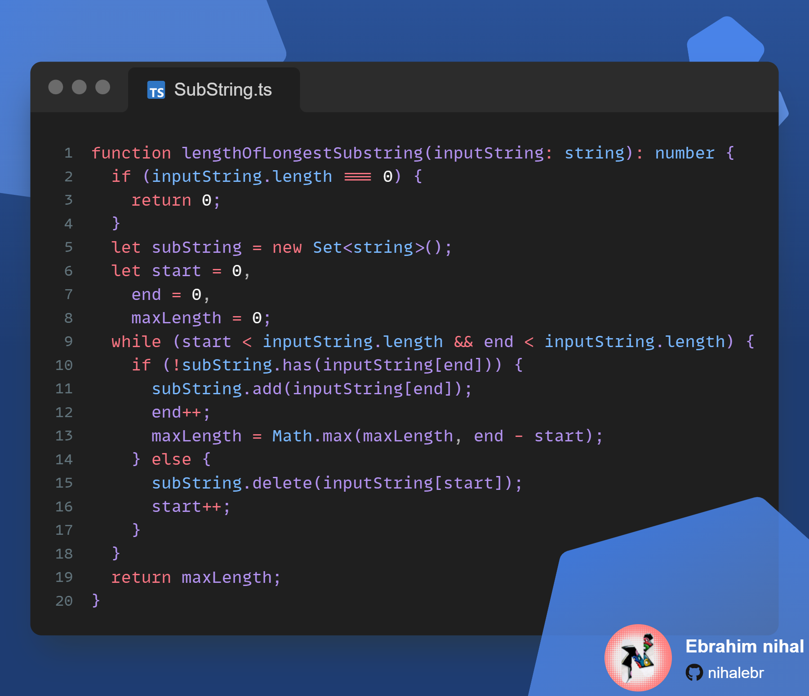

# Sliding Window Technique

It is a technique used to solve problems that involve searching for a subset of data in an array or linked list. The technique is also known as the two pointer technique.

I have used this technique to solve the Longest Substring Without Repeating Characters problem.

We start search from the beginning of the array and keep on moving the right pointer until we find a repeating character. Once we find a repeating character, we move the left pointer to the right of the repeating character and start searching again.

Following image shows the process of the sliding window technique.


## Code



Inizializing the variables.
Setting the `start` and `end` to 0, also setting the `maxlength` to 0.

```ts
...
  let subString = new Set<string>();
  let start = 0,
    end = 0,
    maxLength = 0;
...
```

Looping through the string. Using the while loop with condition `start < inputString.length` and `end < inputString.length`.

```ts
    ...
    while (start < inputString.length && end < inputString.length)
    ...
```

Checking if the `subString` set contains the character at the `end` index of the string. If it does not contain the character, we add the character to the set and increment the `end` index. We also check if the `maxLength` is less than the `subString` set size. If it is, we set the `maxLength` to the `subString` set size.

```ts
    ...
    if (!subString.has(inputString[end])) {
        subString.add(inputString[end]);
        end++;
        maxLength = Math.max(maxLength, subString.size);
    }
    ...
```

if the `subString` set contains the character at the `end` index of the string, we remove the character at the `start` index of the string from the set and increment the `start`.

```ts
    ...
    else {
        subString.delete(inputString[start]);
        start++;
    }
    ...
```

finaly we return the `maxLength`.

```ts
    ...
    return maxLength;
    }
```

---

The complete code is available on [Github](https://github.com/nihalebr/sturdy-spoon) in TypeScript and golang .
