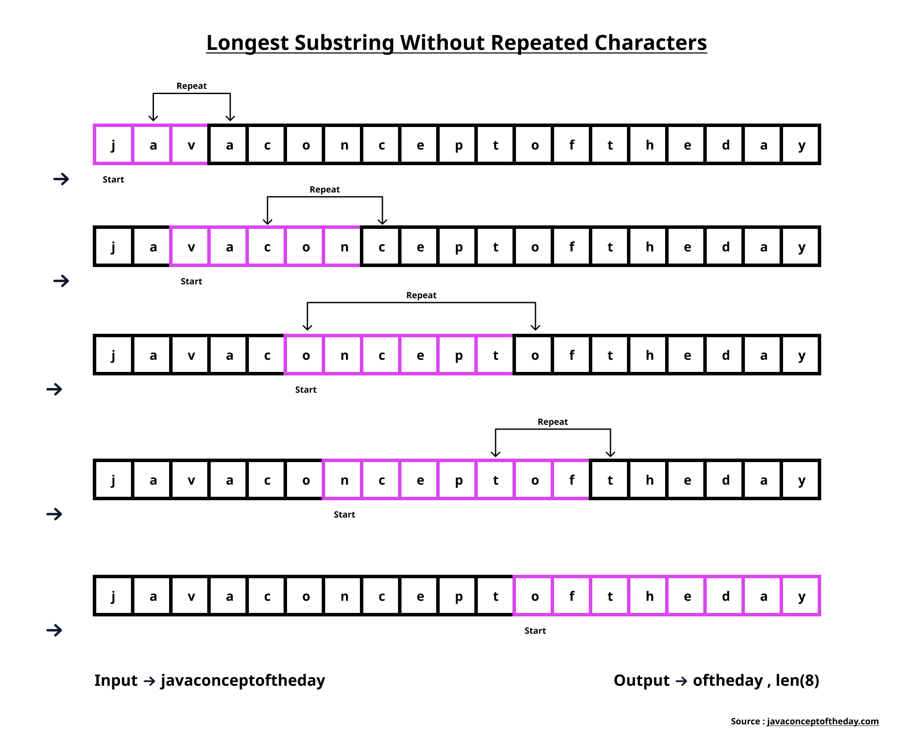

# README

This code is to find the longest substring without repeating characters.



## Run

- To run the TypeScript code, you need to have [Node.js](https://nodejs.org/en/) installed on your machine. <br>
  And [TypeScript](https://www.typescriptlang.org/) compiler installed globally.

  ```bash
  npm install -g typescript
  ```

  After that you can run the code using the following command:

  ```bash
  tsc substring.ts && node substring.js
  ```

- To run the Go code, you need to have [Go](https://go.dev/) installed on your machine. You can download it from [here](https://go.dev/dl/).<br>
  After the go binary and package installed. You can run code by using follwing command.

  ```bash
  go run substring.go
  ```

  ***
